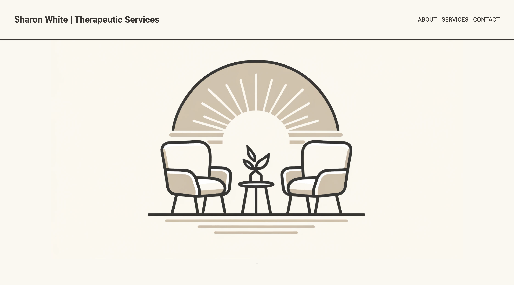
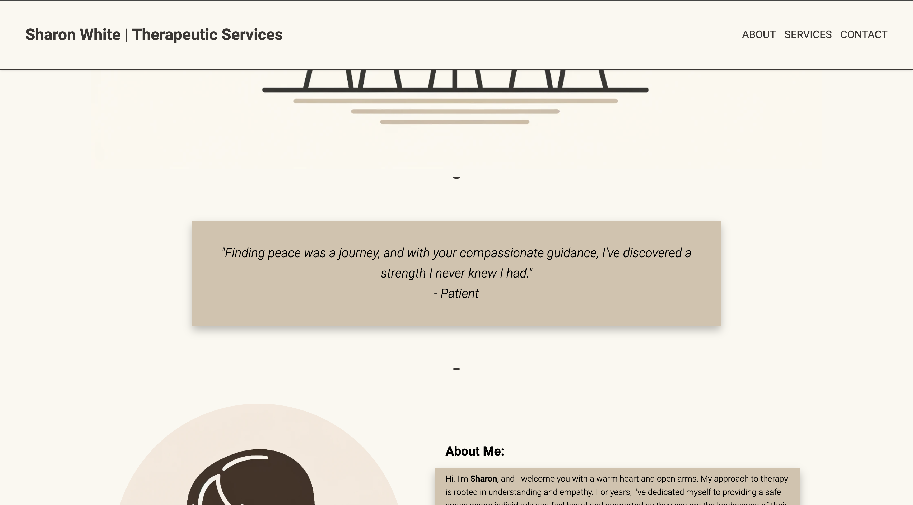
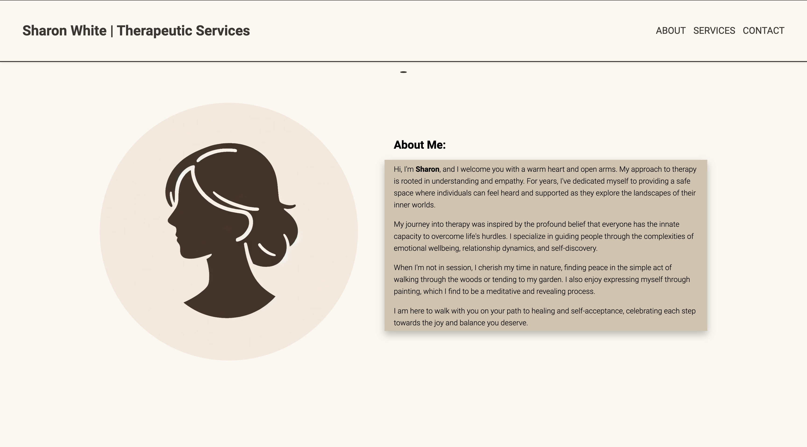
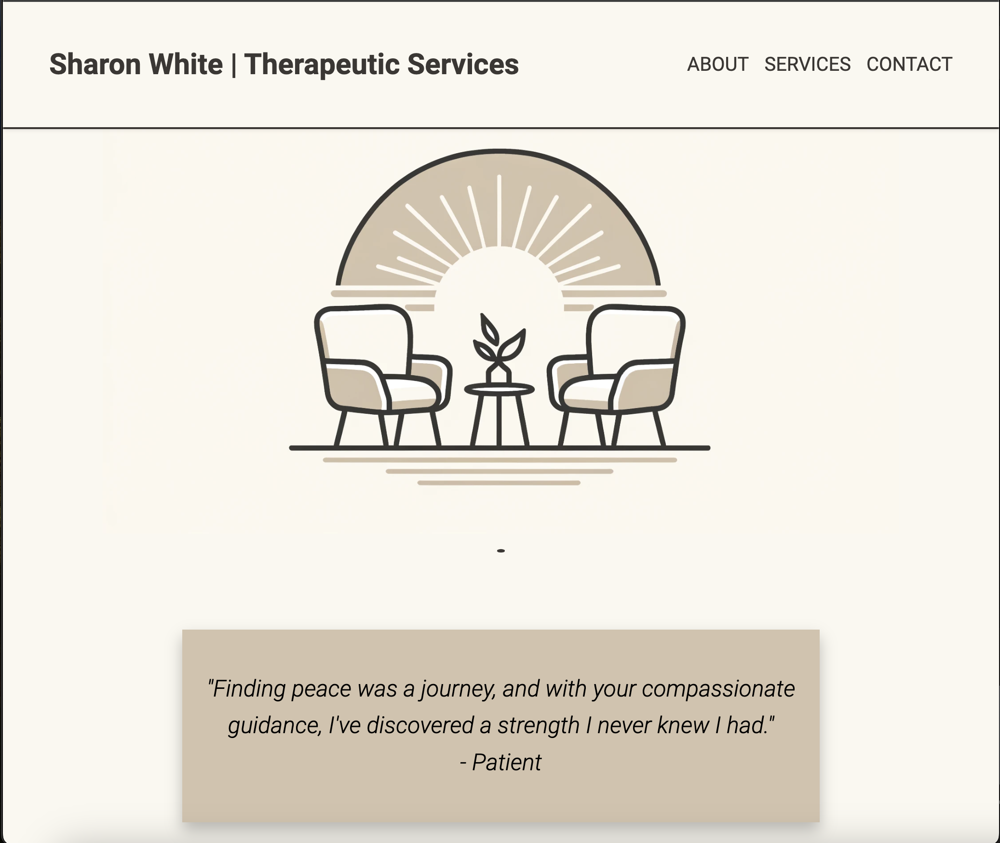
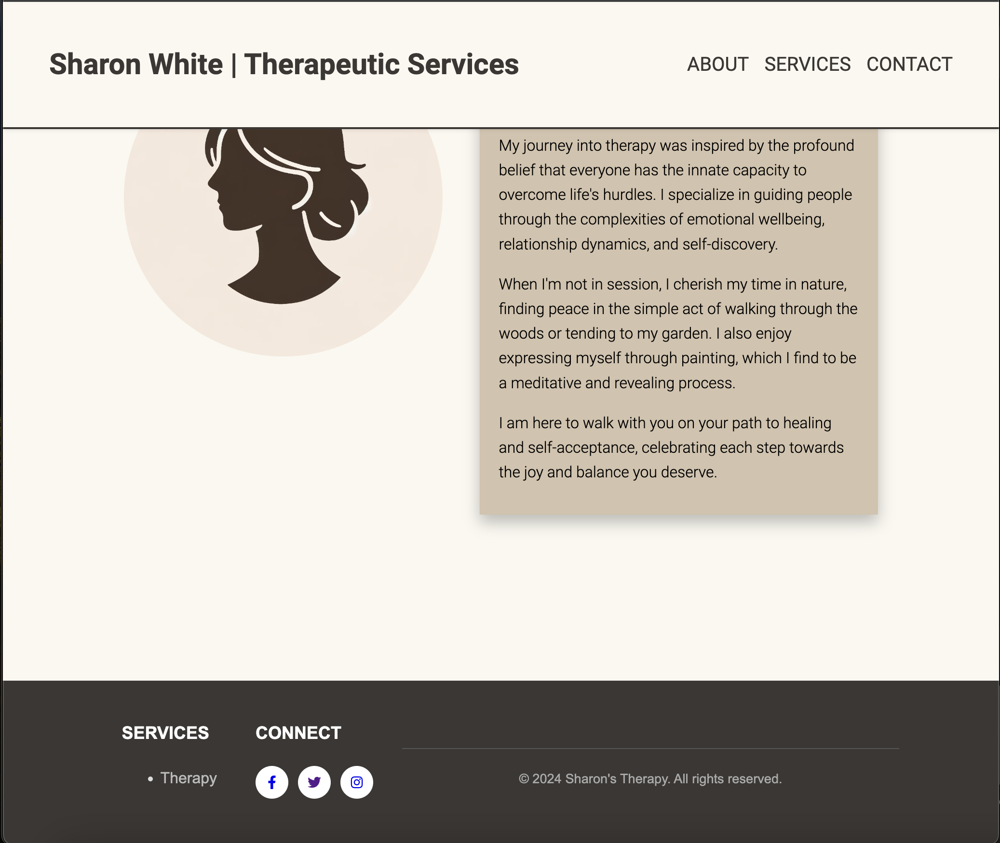
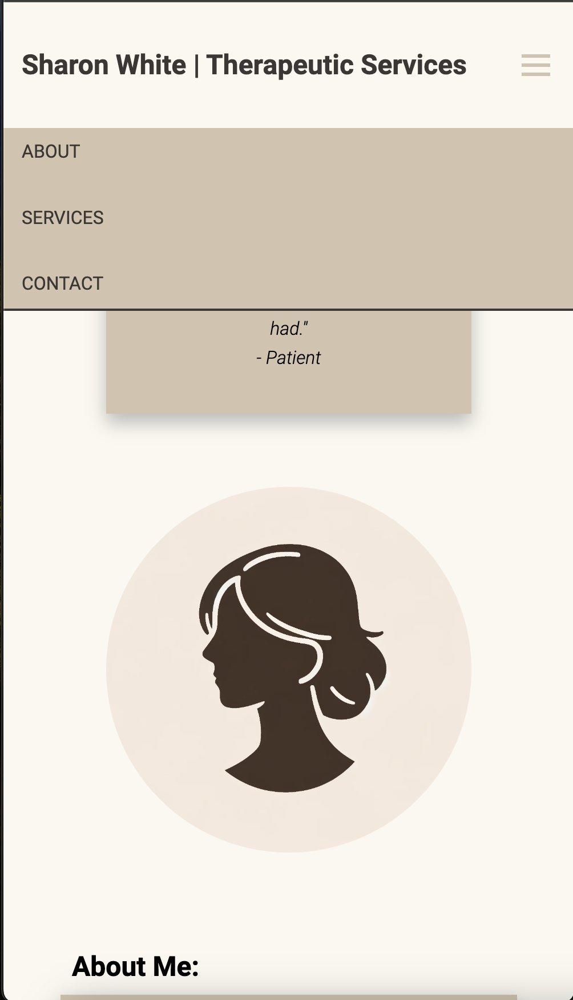
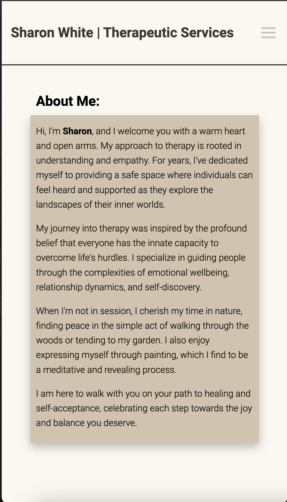

# Sharon White | Therapeutic Services

Welcome to the code repository for a Therapeutic Services website. This React-based website provides information about the therapeutic services offered by Sharon White, a certified therapist dedicated to promoting mental health and well-being.

## Features

- **Responsive Design**: The website is fully responsive, ensuring a seamless experience across various devices and screen sizes.
- **Interactive UI**: Utilizes React's component-based architecture for interactive user interfaces.
- **Accessibility**: Implements best practices for web accessibility, allowing users of all abilities to navigate and interact with the website.
- **Modern Aesthetics**: Features a clean and modern design aesthetic that reflects the calming nature of the therapeutic services offered.

